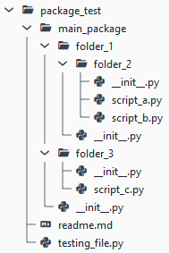
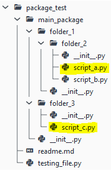
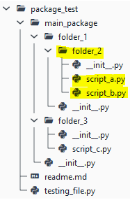
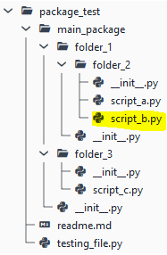

# Demo of imports related to packages
This simple tutorials shows common ways of importing packages, and modules from packages.

We start with the below structure of a project and will be editing it to incorporate a certain import-based behaviour.

**Structure**:



We thus have one `main_package` package, which contains 3 subpackages:
- `folder_1` and `folder_3` are subpackages which are at the same level
- `folder_2` is a subpackages of `folder_1`

Package **`folder_1`** contains:
- only subpackage `folder_2`

Package **`folder_2`** contains:
- module `script_a.py` with method `hw_script_a()`
- module `script_b.py` with method `hw_script_b()`

Package **`folder_3`** contains:
- module `script_c.py` with method `hw_script_c()`

All `__init__.py` files are empty and also `testing_file.py` is empty.

_Note_: the module `testing_file.py` lies outside (above) the `main_package` and will be main executed file.

***
The **key** to referencing is that **`main_package`** is the _top-level_ package for all the packages. Thus referencing between packages/modules is wrt their location in `main_package`.
***

# Case 1: `script_a.py` in `folder_2` imports `script_c.py` in `folder_3`
Git branch of this example is: `case_1`
---


`script_a.py` (this module will be importing):
```python   
from main_package.folder_3 import script_c # this is absolute import

def test_imported_method(): # use the imported method from script_c
    script_c.hw_script_c()
```

`testing_file.py` (this module will execute a method in module `script_a.py`):
```python
import main_package.folder_1.folder_2.script_a as script_a

script_a.test_imported_method()
```
---
_Alternatively_, we could do a _relative_ import of `script_c.py` as follows.

`script_a.py`:
```python
from ...folder_3 import script_c # this is relative import

def test_imported_method():
    script_c.hw_script_c()
```
The three dots `...` here mean that that to reach `folder_3` from `script_a.py` we need to climb up _two_ folders to get to  `main_package` from which `folder_3` containing `script_c.py` can be referenced. 

(`.` = same folder, `..` = one level up, `...` = two levels up)

# Case 2: Use `__init__.py` to simplify imports
Git branch of this example is: `case_2`
---
Often, we would like the import the _whole package_, instead of one-by-one its individual modules. In our example, we would like to have access to methods in all modules of the package `folder_2`. This is done by adding into that package's `__init__.py` file the imports of the modules that will be associated with the package.

We want to associate all methods of package `folder_2` with it. 



First add the _all methods import_ into `__init__.py` in `folder_2`:
```python
from .script_a import *
from .script_b import *
```
-> this means that whenever `folder_2` is imported, it will expose all methods available in modules `scipt_a.py` and `script_b.py`.

Then import `folder_2` using `testing_file.py` and test that we can refer to any method in :
```python
import main_package.folder_1.folder_2 as folder_2

folder_2.hw_script_a()
folder_2.hw_script_b()
```
Here, we no longer needed to specify from which _module_ of package `folder_2` the methods `hw_script_a()` and `hw_script_b()` should be taken from.
This is because both methods are due to the imports defined in `__init__.py` associated with the package `folder_2`.

---
_Note_: whatever we import using the `__init__.py` (of `folder_2`) will be associated with `folder_2` package. For example we could have in `__init__.py` of `folder_2`
```python
from .script_a import *
from .script_b import *
from scipy.stats import norm
```

Then it is possible to call in `testing_file.py`:
```python
import main_package.folder_1.folder_2 as folder_2

folder_2.hw_script_a()
folder_2.hw_script_b()
print(folder_2.norm.cdf(1.6448536269514729)) # should result into 0.95 as there is 95% probability that a normal variable is smaller than 1.64485..
```

# Case 3: Importing only a specific method from a module
Git branch of this example is: `case_3`
---
In this example, we would like to import method `hw_script_b()` that is in the module `script_b` and make it accessible in the module `testing_file.py`.



The only thing we need to do is to modify `testing_file.py`:
```python
from main_package.folder_1.folder_2.script_b import hw_script_b

hw_script_b()
```